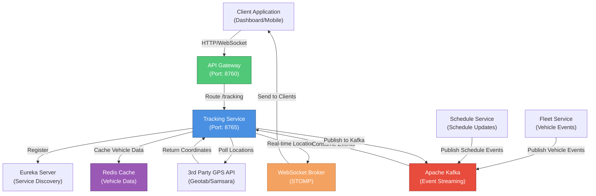
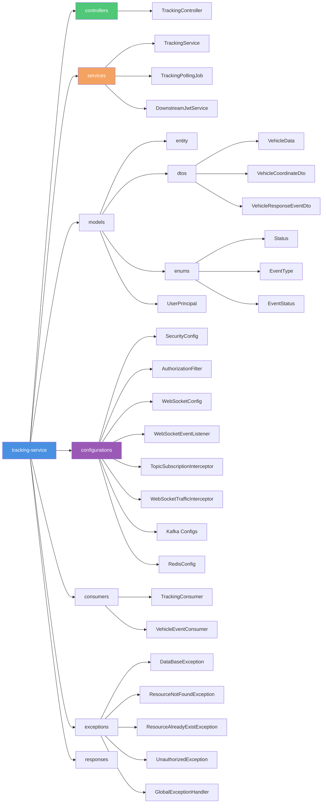
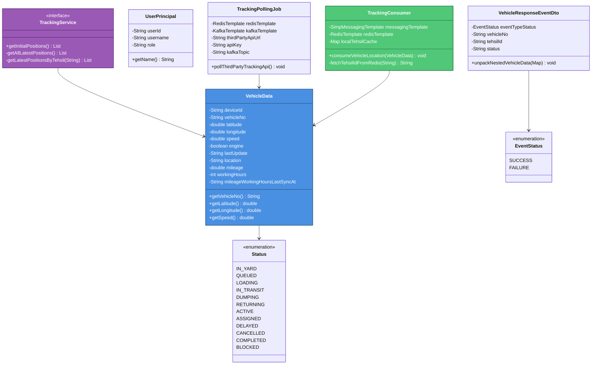

# Tracking Service - WTMS (Waste Transportation Management System)

## Service Overview

The **Tracking Service** is the real-time GPS location and vehicle tracking microservice within the WTMS ecosystem. It provides live vehicle position updates, vehicle status monitoring, and WebSocket-based real-time location broadcasting to supervisors and administrators. This service bridges external GPS tracking APIs with the WTMS platform, enabling supervisors to monitor waste collection vehicles in real-time as they progress through collection routes.

### Key Responsibilities

- **Real-Time GPS Tracking**: Fetches live GPS coordinates from external tracking systems via scheduled polling
- **WebSocket Broadcasting**: Streams vehicle locations to connected clients via STOMP protocol for real-time dashboard updates
- **Role-Based Location Visibility**: Admins see all vehicle locations globally; supervisors see only their assigned tehsil's vehicles
- **Kafka Event Integration**: Consumes vehicle status events and broadcasts location changes through Kafka
- **Location Caching**: Stores vehicle locations in Redis with tehsil assignments for quick retrieval
- **Initial Position Data**: Provides REST endpoint for fetching all active vehicle positions on dashboard load
- **Vehicle Status Tracking**: Maintains up-to-date vehicle status from Fleet Service events
- **WebSocket Connection Management**: Handles client connection lifecycle, authentication, subscription validation
- **3rd Party GPS API Integration**: Polls external tracking systems with fallback URL support
- **Event-Driven Updates**: Listens to vehicle events and location updates from Kafka topics

### Business Context

The Tracking Service enables **real-time operational visibility** for waste collection supervisors. As vehicles progress through collection routes (IN_YARD → QUEUED → LOADING → IN_TRANSIT → DUMPING → RETURNING → COMPLETED), supervisors need to see live GPS locations to:

- Monitor vehicle progress and identify delays
- Optimize dispatch decisions based on real-time vehicle positions
- Ensure compliance with planned routes
- Respond to emergencies or breakdowns quickly
- Track fuel efficiency and vehicle performance
- Validate trips completion with location proof

This service provides the real-time data layer that enables supervisors to make data-driven dispatch decisions and ensure operational efficiency.

---

## Architecture & Design

### High-Level Architecture Diagram



### Package Diagram (Internal Structure)



### Class Diagram (Core Domain Model)



---

## Setup & Execution

### Prerequisites

Ensure the following services and tools are installed and running on your machine:

- **Java Development Kit (JDK)**: Version 17 or higher
- **Apache Maven**: Version 3.8.1 or higher
- **Apache Kafka**: Version 3.0+ (for event streaming)
- **Redis**: Version 6.0+ (for vehicle location and status caching)
- **Eureka Server**: Running on `http://localhost:8761/eureka/` (for service discovery)
- **External GPS Tracking API**: Configured with valid credentials (Geotab, Samsara, or custom)
- **Other Services**: Fleet Service and Schedule Service for event integration

### Step 1: Clone the Repository

```bash
git clone <repository-url>
cd BackEnd/tracking-service
```

### Step 2: Configure Environment Variables

Update `src/main/resources/application.properties` with your environment-specific values:

```properties
# Application Configuration
spring.application.name=tracking-service
server.port=8765

# Kafka Configuration
kafka.bootstrap.server=localhost:9092
kafka.consumer.group=tracking-group
spring.kafka.producer.bootstrap-servers=localhost:9092

# Redis Configuration
spring.data.redis.host=localhost
spring.data.redis.port=6379
spring.data.redis.database=4

# Eureka Configuration
eureka.client.service-url.defaultZone=http://localhost:8761/eureka/
eureka.instance.prefer-ip-address=true

# JWT Configuration (for token validation)
jwt.public-key.path=classpath:certs/public_key.pem
app.security.internal-secret=your_secret_key

# 3rd Party GPS Tracking API Configuration
tracking.api.url=https://tracking-api.example.com/api/vehicles/location
tracking.api.key=your_api_key_here
tracking.api.fallback-url=https://fallback-tracking-api.example.com/api/locations

# Kafka Topics
tracking.kafka.topic=live-coordinates-topic
tracking.kafka.mock-topic=live-coordinates-mock-topic

# Logging Configuration
logging.level.com.yasirkhan.tracking=DEBUG
logging.level.org.springframework.security=INFO
```

### Step 3: Build the Service

```bash
# Clean and build with Maven
mvn clean install

# Or skip tests for faster build
mvn clean install -DskipTests
```

### Step 4: Run the Service Locally

```bash
# Option 1: Using Maven Spring Boot plugin
mvn spring-boot:run

# Option 2: Run the generated JAR
java -jar target/tracking-service-0.0.1-SNAPSHOT.jar
```

### Step 5: Verify the Service

Once the service is running, verify its status:

```bash
# Health Check
curl -X GET http://localhost:8765/actuator/health

# Check Eureka Registration
curl -X GET http://localhost:8761/eureka/apps/tracking-service

# Test REST Endpoint
curl -X GET http://localhost:8765/tracking/live/initial \
  -H "Authorization: Bearer <admin_jwt_token>"

# Test WebSocket Connection (using wscat)
wscat -c ws://localhost:8765/tracking
# Subscribe to topic: sub /user/queue/tracking-positions

# Swagger UI (OpenAPI Documentation)
# Open in browser: http://localhost:8765/swagger-ui.html
```

### Default Port Configuration

| Service | Port | Description |
|---------|------|-------------|
| Tracking Service | `8765` | Real-Time Vehicle Tracking |
| WebSocket Endpoint | `/tracking` | STOMP over WebSocket |
| Eureka Server | `8761` | Service Discovery |
| Kafka | `9092` | Event Streaming |
| Redis | `6379` | Vehicle Data & Location Cache |

---

## Environment Variables & Application Properties

### Required Configuration Table

| Property | Type | Default | Description | Example |
|----------|------|---------|-------------|---------|
| `spring.application.name` | String | `tracking-service` | Microservice identifier | `tracking-service` |
| `server.port` | Integer | `8765` | HTTP/WebSocket server port | `8765` |
| `kafka.bootstrap.server` | String | Required | Kafka broker address | `localhost:9092` |
| `kafka.consumer.group` | String | `tracking-group` | Kafka consumer group ID | `tracking-group` |
| `spring.data.redis.host` | String | Required | Redis server hostname | `localhost` |
| `spring.data.redis.port` | Integer | `6379` | Redis server port | `6379` |
| `spring.data.redis.database` | Integer | `4` | Redis database number | `4` |
| `tracking.api.url` | String | Required | 3rd-party GPS tracking API endpoint | `https://api.geotab.com/v1/vehicles` |
| `tracking.api.key` | String | Required | API key for 3rd-party tracking service | `your_api_key_here` |
| `tracking.api.fallback-url` | String | Optional | Fallback tracking API URL | `https://fallback-api.example.com/api` |
| `tracking.kafka.topic` | String | `live-coordinates-topic` | Kafka topic for live coordinates | `live-coordinates-topic` |
| `tracking.kafka.mock-topic` | String | `live-coordinates-mock-topic` | Kafka topic for mock data | `live-coordinates-mock-topic` |
| `jwt.public-key.path` | String | Required | Path to RSA public key (PEM) | `classpath:certs/public_key.pem` |
| `app.security.internal-secret` | String | Required | Internal API secret key (minimum 32 chars) | `yK8!pL3@xQ7#dT9$wF2^sR5&vM1*bN6(` |
| `eureka.client.service-url.defaultZone` | String | Required | Eureka server URL | `http://localhost:8761/eureka/` |
| `eureka.instance.prefer-ip-address` | Boolean | `true` | Use IP address instead of hostname | `true` |
| `management.tracing.sampling.probability` | Float | `1.0` | Distributed tracing sample rate (0.0-1.0) | `1.0` |
| `logging.level.com.yasirkhan.tracking` | String | `INFO` | Application logging level | `DEBUG` / `INFO` |
| `spring.jpa.show-sql` | Boolean | `false` | Print SQL statements to console | `false` / `true` |

### Kafka Topics Configuration

| Topic | Consumer Group | Producer | Purpose |
|-------|----------------|----------|---------|
| `live-coordinates-topic` | `tracking-group` | TrackingPollingJob | Live GPS coordinates from 3rd-party API |
| `live-coordinates-mock-topic` | `tracking-group` | TrackingPollingJob | Mock coordinate data for testing/demo |
| `vehicle-response-topic` | `tracking-group` | Fleet Service | Vehicle status and assignment changes |

---

## API Endpoints

### REST Endpoints

| HTTP Method | Endpoint | Role Required | Description | Request Parameters | Response |
|-------------|----------|---------------|-------------|-------------------|----------|
| `GET` | `/tracking/live/initial` | `ADMIN`, `SUPERVISOR` | Get initial vehicle positions for dashboard load | None | HTTP 200 OK, `List<VehicleData>` containing all active vehicles |
| `GET` | `/actuator/health` | Public | Service health status | None | `{ "status": "UP/DOWN", "components": {...} }` |
| `GET` | `/actuator/metrics` | Public | Application metrics | None | Micrometer metrics |
| `GET` | `/swagger-ui.html` | Public | OpenAPI documentation | None | Interactive API documentation |

### WebSocket Endpoints

#### WebSocket Connection

```
Endpoint: ws://localhost:8765/tracking
Protocol: STOMP over WebSocket
Authentication: Required (JWT Bearer token in header)
```

#### Available Topics & Subscriptions

| Topic | Role | Description | Message Format |
|-------|------|-------------|-----------------|
| `/topic/tracking/all` | `ADMIN` | All vehicle locations globally | `VehicleData` object with GPS coordinates |
| `/topic/tracking/tehsil/{tehsilId}` | `SUPERVISOR` | Vehicles assigned to specific tehsil | `VehicleData` object filtered by tehsilId |
| `/topic/tracking/auto` | `ADMIN`, `SUPERVISOR` | Auto-routed based on user role | Dynamically routes to appropriate topic |
| `/user/queue/tracking-positions` | Authenticated | User-specific position updates | `VehicleData` object |

#### STOMP Frame Examples

**Connect to WebSocket**:
```
CONNECT
accept-version:1.0,1.1,1.2
heart-beat:0,0
Authorization:Bearer <jwt_token>

^@
```

**Subscribe to All Vehicles (Admin)**:
```
SUBSCRIBE
id:0
destination:/topic/tracking/all

^@
```

**Subscribe to Tehsil Vehicles (Supervisor)**:
```
SUBSCRIBE
id:1
destination:/topic/tracking/tehsil/550e8400-e29b-41d4-a716-446655440000

^@
```

**Receive Location Update Message**:
```
MESSAGE
content-type:application/json
subscription:0
message-id:1
ack:auto

{"deviceId":"GPS-001","vehicleNo":"PKI-123","latitude":33.7250,"longitude":73.2000,"speed":45.5,"engine":true,"lastUpdate":"2026-06-22T10:30:45Z","location":"Main Road, Islamabad","mileage":12500.0,"workingHours":8,"mileageWorkingHoursLastSyncAt":"2026-06-22T10:00:00Z"}
^@
```

**Disconnect from WebSocket**:
```
DISCONNECT
receipt:1

^@
```

### Example API Requests

#### Get Initial Vehicle Positions
```bash
curl -X GET http://localhost:8765/tracking/live/initial \
  -H "Authorization: Bearer <supervisor_jwt_token>"
```

#### Response Example
```json
[
  {
    "deviceId": "GPS-001",
    "vehicleNo": "PKI-123",
    "latitude": 33.7250,
    "longitude": 73.2000,
    "speed": 45.5,
    "engine": true,
    "lastUpdate": "2026-06-22T10:30:45Z",
    "location": "Main Road, Islamabad",
    "mileage": 12500.0,
    "workingHours": 8,
    "mileageWorkingHoursLastSyncAt": "2026-06-22T10:00:00Z"
  }
]
```

#### JavaScript WebSocket Client Example
```javascript
// Connect to WebSocket
const socket = new WebSocket('ws://localhost:8765/tracking');
const client = Stomp.over(socket);

// Connection headers with JWT
const headers = {
  'Authorization': 'Bearer ' + jwtToken,
  'login': 'tracking-client',
  'passcode': ''
};

// Connect and subscribe
client.connect(headers, function(frame) {
  console.log('Connected to Tracking Service');

  // Subscribe to all vehicles (Admin)
  client.subscribe('/topic/tracking/all', function(message) {
    const vehicleData = JSON.parse(message.body);
    console.log('Vehicle Location:', vehicleData);
    updateMapMarker(vehicleData);
  });

  // Or subscribe to tehsil (Supervisor)
  client.subscribe('/topic/tracking/tehsil/tehsil-id-123', function(message) {
    const vehicleData = JSON.parse(message.body);
    console.log('Vehicle in your Tehsil:', vehicleData);
    updateMapMarker(vehicleData);
  });
});

// Disconnect
function disconnect() {
  client.disconnect(function() {
    console.log('Disconnected from Tracking Service');
  });
}
```

#### Angular/Reactive Client Example
```typescript
import * as SockJS from 'sockjs-client';
import * as Stomp from '@stomp/stompjs';

export class TrackingService {
  private stompClient: any;

  connect(jwtToken: string): Observable<VehicleData> {
    return new Observable(observer => {
      const socket = new SockJS('http://localhost:8765/tracking');
      this.stompClient = Stomp.over(socket);
      
      this.stompClient.connect(
        { 'Authorization': 'Bearer ' + jwtToken },
        () => {
          this.stompClient.subscribe('/topic/tracking/all', (message) => {
            observer.next(JSON.parse(message.body));
          });
        }
      );
    });
  }
}
```

---

## Test Cases & Documentation

### Core Test Scenarios

| Scenario ID | Category | Scenario Description | Input Parameters | Expected Output | Validation Type |
|-------------|----------|----------------------|-------------------|------------------|-----------------|
| **TRACK-TC-001** | REST API | Get initial positions as Admin | JWT token (ADMIN role) | HTTP 200 OK, list of all vehicles | Integration Test |
| **TRACK-TC-002** | REST API | Get initial positions as Supervisor | JWT token (SUPERVISOR role) | HTTP 200 OK, filtered vehicles for tehsil | Integration Test |
| **TRACK-TC-003** | REST API | Get initial positions without JWT | No authorization header | HTTP 401 Unauthorized | Unit Test |
| **TRACK-TC-004** | REST API | Get initial positions with invalid JWT | Malformed/expired JWT token | HTTP 401 Unauthorized, "Invalid token" | Unit Test |
| **TRACK-TC-005** | REST API | Get initial positions as Driver | JWT token (DRIVER role) | HTTP 403 Forbidden, "Insufficient permissions" | Unit Test |
| **TRACK-TC-006** | REST API | No vehicles in active list | Database empty/no active vehicles | HTTP 200 OK, empty array `[]` | Integration Test |
| **TRACK-TC-007** | WebSocket | Connect as Admin | JWT token + STOMP CONNECT | WebSocket connection established (code 101) | Integration Test |
| **TRACK-TC-008** | WebSocket | Connect without JWT | STOMP CONNECT without authorization | Connection refused or closed | Integration Test |
| **TRACK-TC-009** | WebSocket | Subscribe to /topic/tracking/all (Admin) | Admin JWT, SUBSCRIBE to /topic/tracking/all | SUBSCRIBED ACK, location updates received | Integration Test |
| **TRACK-TC-010** | WebSocket | Subscribe to /topic/tracking/all (Supervisor) | Supervisor JWT, SUBSCRIBE to /topic/tracking/all | SUBSCRIBED ACK but no messages sent (filtered) | Integration Test |
| **TRACK-TC-011** | WebSocket | Subscribe to /topic/tracking/tehsil/{id} (Supervisor) | Supervisor JWT, SUBSCRIBE to own tehsil | SUBSCRIBED ACK, only vehicles in tehsil received | Integration Test |
| **TRACK-TC-012** | WebSocket | Subscribe to /topic/tracking/tehsil/{id} (Supervisor - different tehsil) | Supervisor JWT, SUBSCRIBE to different tehsil | Connection refused or Authorization error | Integration Test |
| **TRACK-TC-013** | WebSocket | Receive initial location update | TrackingConsumer publishes VehicleData to /topic/tracking/all | MESSAGE frame with VehicleData received at client | Integration Test |
| **TRACK-TC-014** | WebSocket | Multiple admins connected | 5 Admin JWT tokens connecting | All 5 connections established, all receive updates | Performance Test |
| **TRACK-TC-015** | WebSocket | Disconnect from WebSocket | Connected client sends DISCONNECT | RECEIPT acknowledgment, connection closed | Integration Test |
| **TRACK-TC-016** | Kafka Consumer | Consume live-coordinates-topic message | VehicleData published to Kafka | TrackingConsumer processes, broadcasts via WebSocket | Integration Test |
| **TRACK-TC-017** | Kafka Consumer | Consume vehicle-response-topic event | VehicleResponseEventDto published | VehicleEventConsumer caches in Redis with key `wtms:vehicle:PKI-123` | Integration Test |
| **TRACK-TC-018** | Kafka Consumer | Vehicle status update from Fleet Service | Status changed from LOADING to IN_TRANSIT | Redis cache updated, WebSocket broadcast triggered | Integration Test |
| **TRACK-TC-019** | Scheduled Job | Polling 3rd-party API (normal case) | Timer triggers polling job | VehicleCoordinateDto fetched, published to Kafka | Integration Test |
| **TRACK-TC-020** | Scheduled Job | Polling 3rd-party API (API timeout) | API response timeout (>30 seconds) | Fallback URL attempted, graceful error logging | Integration Test |
| **TRACK-TC-021** | Scheduled Job | Polling 3rd-party API (both URLs fail) | Primary and fallback URLs both timeout | Error logged, Kafka message queued for retry | Integration Test |
| **TRACK-TC-022** | Redis Integration | Cache vehicle with tehsilId | Vehicle event received, stored with tehsilId | Redis key: `wtms:vehicle:PKI-123`, value: `{tehsilId: "123", status: "IN_TRANSIT"}` | Integration Test |
| **TRACK-TC-023** | Redis Integration | Supervisor queries vehicles for tehsil | TrackingService.getLatestPositionsByTehsil("tehsil-123") | Redis SCAN pattern `wtms:live:vehicle:*`, tehsil filter applied | Integration Test |
| **TRACK-TC-024** | Performance | Handle 1000 concurrent WebSocket connections | 1000 clients subscribing | All connections accepted, location updates delivered within 500ms | Performance Test |
| **TRACK-TC-025** | Performance | Broadcast location to 500 supervisors | Location update published, 500 supervisors subscribed | All supervisors receive update within 300ms | Performance Test |
| **TRACK-TC-026** | Authorization | WebSocket topic subscription validation | Supervisor attempts to auto-subscribe | TopicSubscriptionInterceptor validates role, routes correctly | Unit Test |
| **TRACK-TC-027** | Authorization | Invalid role in JWT token | JWT with unknown role, attempt to subscribe | WebSocket rejects subscription, authorization error | Unit Test |
| **TRACK-TC-028** | Error Handling | Redis connection failure during subscribe | Redis unavailable, client subscribes | Service degrades gracefully, error logged | Integration Test |
| **TRACK-TC-029** | Error Handling | Kafka consumer fails to deserialize message | Malformed VehicleData in Kafka | Error logged, message skipped, service continues | Integration Test |
| **TRACK-TC-030** | Event Lifecycle | Vehicle event received → Cached → Broadcasted | VehicleResponseEventDto consumed and broadcast | Complete flow tested: Kafka → Redis → WebSocket | Integration Test |
| **TRACK-TC-031** | Data Validation | VehicleData with missing coordinates | GPS location = null/0, speed = -1 | Message accepted but flagged as invalid location | Unit Test |
| **TRACK-TC-032** | Data Validation | VehicleData with invalid speed | speed > 200 km/h in city area | Warning logged, data accepted, alert generated | Unit Test |
| **TRACK-TC-033** | Tehsil Filtering | Supervisor receives vehicle from other tehsil | Vehicle tehsilId ≠ supervisor tehsilId | Message NOT sent to supervisor (filtered) | Integration Test |
| **TRACK-TC-034** | Geospatial | Vehicle at geofence boundary | Latitude/longitude at yard boundary | Event detected and logged (if geofencing implemented) | Integration Test |
| **TRACK-TC-035** | Monitoring | Health check endpoint | GET /actuator/health | HTTP 200, `{"status":"UP"}` | Integration Test |
| **TRACK-TC-036** | Monitoring | Metrics endpoint | GET /actuator/metrics | HTTP 200, Micrometer metrics | Integration Test |
| **TRACK-TC-037** | Monitoring | Distributed tracing | Request with trace ID | Trace ID propagated through logs and metrics | Integration Test |
| **TRACK-TC-038** | Connection Lifecycle | WebSocketEventListener.handleWebSocketConnectListener | Client connects | Log entry: "SOCKET CONNECT ATTEMPT: User 'xyz' attempting to connect" | Integration Test |
| **TRACK-TC-039** | Connection Lifecycle | WebSocketEventListener.handleWebSocketDisconnectListener | Client disconnects | Log entry: "SOCKET DISCONNECTED: User 'xyz' has disconnected" | Integration Test |
| **TRACK-TC-040** | Cross-Service Integration | Trip Service queries active vehicle schedule | Trip Service queries Schedule Service | Tracking Service remains independent, no direct interaction | Integration Test |

### Running Tests

```bash
# Run all tests
mvn test

# Run specific test class
mvn test -Dtest=TrackingServiceApplicationTests

# Run tests with coverage
mvn clean test jacoco:report

# View coverage report
# Open target/site/jacoco/index.html in browser
```

### Test Dependencies

The project includes the following testing frameworks:

```xml
<dependency>
    <groupId>org.springframework.boot</groupId>
    <artifactId>spring-boot-starter-test</artifactId>
    <scope>test</scope>
</dependency>
<dependency>
    <groupId>org.springframework.kafka</groupId>
    <artifactId>spring-kafka-test</artifactId>
    <scope>test</scope>
</dependency>
```

---

## Key Components & Their Roles

### Security & Authorization

- **AuthorizationFilter**: Intercepts HTTP and WebSocket requests, validates JWT tokens, extracts user claims
- **SecurityConfig**: Configures Spring Security with stateless session management and JWT-based authentication
- **JWT Validation**: Validates tokens from Auth Service using RSA public key
- **TopicSubscriptionInterceptor**: Validates WebSocket topic subscriptions and enforces role-based access (ADMIN sees all, SUPERVISOR sees only tehsil)
- **WebSocketTrafficInterceptor**: Monitors outbound WebSocket messages for audit and traffic analysis

### Real-Time Communication

- **WebSocketConfig**: Configures STOMP over WebSocket with message broker at `/tracking` endpoint
- **WebSocketEventListener**: Handles lifecycle events (connect, disconnect, subscribe) with detailed logging
- **SimpMessagingTemplate**: Sends location updates to WebSocket topics (`/topic/tracking/all`, `/topic/tracking/tehsil/{id}`)

### Data Integration & Caching

- **TrackingService**: Retrieves initial vehicle positions from Redis, applies role-based filtering
- **RedisTemplate**: Stores vehicle location data with patterns:
  - `wtms:vehicle:{vehicleNo}` - Vehicle status and tehsil assignment
  - `wtms:live:vehicle:{vehicleNo}` - Active vehicle locations
- **Redis Database 4**: Dedicated database for tracking service vehicle data

### Event-Driven Architecture

- **TrackingConsumer**: Listens to `live-coordinates-topic` from Kafka, broadcasts VehicleData via WebSocket to admins and supervisors
- **VehicleEventConsumer**: Listens to `vehicle-response-topic`, caches vehicle-tehsil mappings in Redis
- **Local Tehsil Cache**: In-memory ConcurrentHashMap to reduce Redis lookups for high-frequency location broadcasts

### 3rd-Party Integration

- **TrackingPollingJob**: Scheduled service (60-second interval) that polls external GPS tracking API (Geotab, Samsara, etc.)
- **RestClient**: Modern HTTP client for calling 3rd-party APIs with timeout handling
- **Fallback URL Support**: Automatically retries with fallback URL if primary API fails
- **Kafka Publishing**: Publishes fetched coordinates to Kafka for distribution

### Error Handling

- **GlobalExceptionHandler**: Handles DatabaseException, UnauthorizedException, ResourceNotFoundException, JwtException
- **Custom Exceptions**: DataBaseException, UnauthorizedException, ResourceNotFoundException, ResourceAlreadyExistException
- **Error Response DTO**: Standardized error responses with status code, message, path, and timestamp

---

## Kafka Topics & Event Flow

### Consumed Topics

```
┌──────────────────────────────────────────────────────────────┐
│                    CONSUMED TOPICS                           │
└──────────────────────────────────────────────────────────────┘

1. live-coordinates-topic
   ├─ Published by: TrackingPollingJob (3rd-party API polling)
   ├─ Consumer Group: tracking-group
   ├─ Payload: VehicleData
   │  ├─ deviceId: GPS device identifier
   │  ├─ vehicleNo: Registration number (e.g., PKI-123)
   │  ├─ latitude: GPS latitude coordinate
   │  ├─ longitude: GPS longitude coordinate
   │  ├─ speed: Current speed in km/h
   │  ├─ engine: Engine on/off status
   │  ├─ lastUpdate: Timestamp of last update
   │  └─ location: Human-readable location
   └─ Action: TrackingConsumer broadcasts to WebSocket /topic/tracking/all
              and /topic/tracking/tehsil/{tehsilId}

2. vehicle-response-topic
   ├─ Published by: Fleet Service
   ├─ Consumer Group: tracking-group
   └─ Payload: VehicleResponseEventDto
      ├─ eventTypeStatus: SUCCESS/FAILURE
      ├─ vehicleNo: Vehicle registration
      ├─ tehsilId: Assigned tehsil
      └─ status: Vehicle status (ACTIVE, BLOCKED, etc.)
      └─ Action: VehicleEventConsumer caches vehicle data in Redis
                 Key: wtms:vehicle:{vehicleNo}
                 Value: {tehsilId, status}
```

### Produced Topics

```
┌──────────────────────────────────────────────────────────────┐
│                    PRODUCED TOPICS                           │
└──────────────────────────────────────────────────────────────┘

1. live-coordinates-topic (if configured as producer)
   ├─ Published by: TrackingPollingJob
   ├─ Consumed by: TrackingConsumer, other services
   └─ Payload: VehicleCoordinateDto with status="success"
      └─ Includes: status, data[]
```

### Event Flow Diagram

```
3rd-Party GPS API
        │
        ▼
TrackingPollingJob (Scheduled every 60 seconds)
        │
        ├─ Polls API endpoint
        ├─ Handles failures with fallback URL
        └─ Publishes VehicleCoordinateDto to Kafka
                │
                ├─ Publishes to: live-coordinates-topic
                │
                ▼
        TrackingConsumer (Kafka Listener)
                │
                ├─ Fetches vehicle tehsilId from Redis
                │
                ├─ Broadcasts to /topic/tracking/all (ALL users)
                │
                └─ Broadcasts to /topic/tracking/tehsil/{tehsilId}
                        │
                        ▼
                WebSocket Clients
                (Admins & Supervisors)
```

---

## WebSocket Connection & Authentication Flow

### Connection Sequence Diagram

```
Client Browser / Mobile App
        │
        ├─ Obtains JWT token from Auth Service
        │
        ├─ Initiates WebSocket: ws://localhost:8765/tracking
        │
        ├─ Sends STOMP CONNECT with Bearer token in header
        │
        ▼
TrackingService
        │
        ├─ AuthorizationFilter intercepts request
        │
        ├─ Validates JWT signature and expiry
        │
        ├─ Extracts UserPrincipal (userId, username, role)
        │
        ├─ Creates STOMP session
        │
        ├─ WebSocketEventListener.handleWebSocketConnectListener (logs attempt)
        │
        ├─ Broker replies with CONNECTED
        │
        ├─ WebSocketEventListener.handleWebSocketConnectedListener (logs success)
        │
        ▼
Client receives CONNECTED
        │
        ├─ Sends STOMP SUBSCRIBE to /topic/tracking/auto
        │
        ▼
TrackingService
        │
        ├─ TopicSubscriptionInterceptor.preSend() intercepts SUBSCRIBE
        │
        ├─ Checks user role:
        │  ├─ If ADMIN: Routes to /topic/tracking/all
        │  └─ If SUPERVISOR: Routes to /topic/tracking/tehsil/{tehsilId}
        │
        ├─ WebSocketEventListener.handleWebSocketSubscribeListener (logs subscription)
        │
        ▼
Client receives SUBSCRIBED
        │
        ├─ Waits for MESSAGE frames with location updates
        │
        └─ Receives VehicleData from TrackingConsumer broadcasts
```

---

## Monitoring & Observability

### Actuator Endpoints

The service exposes the following monitoring endpoints via Spring Boot Actuator:

```bash
# Health check
curl http://localhost:8765/actuator/health

# Application metrics
curl http://localhost:8765/actuator/metrics

# WebSocket metrics
curl http://localhost:8765/actuator/metrics/spring.websocket.connections

# Trace recent requests (if enabled)
curl http://localhost:8765/actuator/httptrace
```

### Logging Configuration

Logs are configured using Log4j2 (high-performance asynchronous logging):

- **Log File**: `logs/tracking-service.log`
- **Log Level**: Configurable per package
- **Async Appender**: Uses Disruptor for high-throughput logging
- **Key Log Messages**:
  - `SOCKET CONNECT ATTEMPT`: User attempting to connect
  - `SOCKET CONNECTED`: Connection successful
  - `SOCKET DISCONNECTED`: User disconnected
  - `Processing location broadcast for vehicle`: Location update processed
  - `Starting scheduled 3rd-party tracking API ingestion cycle`: Polling job started

### Distributed Tracing

- **Micrometer Tracing**: Enabled with Brave bridge for distributed tracing
- **Trace ID Propagation**: 100% sampling enabled
- **Integration**: Compatible with ELK Stack, Jaeger, or Zipkin
- **Trace Context**: Propagated through Kafka messages and WebSocket frames

### WebSocket Traffic Monitoring

- **TrafficInterceptor**: Monitors all outbound WebSocket messages
- **Audit Trail**: Tracks message flow to specific topics
- **Performance Metrics**: Measures message delivery latency

---

## Common Issues & Troubleshooting

### Issue 1: WebSocket Connection Refused

**Symptoms**: `WebSocket connection to 'ws://localhost:8765/tracking' failed`

**Solutions**:
```bash
# Verify service is running on correct port
curl http://localhost:8765/actuator/health

# Check firewall allows WebSocket (port 8765)
# Verify CORS headers are correctly configured
# Check SecurityConfig allows WebSocket paths
```

### Issue 2: JWT Token Validation Fails on WebSocket

**Symptoms**: `WebSocket connection established but subscription denied`

**Solutions**:
```bash
# Verify JWT token is valid
# Check public key path: classpath:certs/public_key.pem exists
# Ensure token expiry is not exceeded
# Verify token contains required claims (userId, role)
```

### Issue 3: Supervisor Cannot See Vehicles from Other Tehsils

**Symptoms**: Supervisor subscribed but not receiving location updates

**Solutions**:
```bash
# This is expected behavior (security feature)
# Verify supervisor's tehsilId is cached in Redis
redis-cli -n 4 HGETALL wtms:user:supervisor-user-id

# Check vehicle's tehsilId matches supervisor's
redis-cli -n 4 HGETALL wtms:vehicle:PKI-123

# If mismatch, issue is in VehicleEventConsumer or vehicle assignment
```

### Issue 4: Kafka Consumer Not Processing Location Messages

**Symptoms**: Location updates published but WebSocket clients not receiving

**Solutions**:
```bash
# Verify Kafka broker running
jps | grep Kafka

# Check topic exists
kafka-topics.sh --list --bootstrap-server localhost:9092

# Check consumer group status
kafka-consumer-groups.sh --describe --bootstrap-server localhost:9092 --group tracking-group

# Monitor messages in Kafka
kafka-console-consumer.sh --bootstrap-server localhost:9092 --topic live-coordinates-topic --from-beginning
```

### Issue 5: 3rd-Party API Polling Fails

**Symptoms**: No vehicles in Redis, empty WebSocket broadcasts

**Solutions**:
```bash
# Verify API URL and credentials in application.properties
# Check API key is valid and not expired
# Test API endpoint directly
curl -X POST https://tracking-api.example.com/api/vehicles/location \
  -H "Authorization: Bearer $API_KEY" \
  -d '{"registrationNumbers": ["PKI-123"]}'

# Check logs for polling job execution
tail -f logs/tracking-service.log | grep "polling"

# Verify fallback URL is configured
```

### Issue 6: High WebSocket Connection Memory Usage

**Symptoms**: Memory usage increases with number of clients, service becomes slow

**Solutions**:
```bash
# Implement connection limits
# Configure message buffer sizes in WebSocketConfig
# Use connection pooling and timeouts
# Monitor active connections
# Consider horizontal scaling with load balancer
```

### Issue 7: Redis Connection Timeout

**Symptoms**: `redis.clients.jedis.exceptions.JedisConnectionException`

**Solutions**:
```bash
# Verify Redis running
redis-cli ping  # Should return PONG

# Check connection string
# redis.host=localhost, redis.port=6379, redis.database=4

# Test direct connection
redis-cli -h localhost -p 6379 -n 4 ping

# Check firewall and network connectivity
```

---

## Performance Optimization

### WebSocket Optimization

- **Message Batching**: Consider batching multiple location updates before broadcasting
- **Compression**: Enable WebSocket compression for large payloads
- **Connection Pooling**: Use connection pools for 3rd-party API calls
- **Local Caching**: TrackingConsumer uses local ConcurrentHashMap to cache tehsil mappings (avoids Redis hits)

### Kafka Optimization

- **Batch Size**: Configure Kafka producer batch size for better throughput
- **Compression**: Enable compression (snappy/lz4) for Kafka topics
- **Partitioning**: Use vehicle registration as partition key for ordered delivery per vehicle

### Redis Optimization

- **TTL Configuration**: Set expiry on vehicle location keys to prevent stale data
- **Key Patterns**: Use efficient SCAN operations instead of KEYS command
- **Database Separation**: Use dedicated Redis database (index 4) for tracking data

### API Polling Optimization

- **Batch Requests**: Poll multiple vehicles in single API call (reduces API calls)
- **Caching**: Cache vehicle list to avoid repeated lookups
- **Backoff Strategy**: Implement exponential backoff for failed API calls

---

## Deployment & Production Checklist

- [ ] Change default passwords and API keys in `application.properties`
- [ ] Configure external Kafka cluster with replication and persistence
- [ ] Configure external Redis instance with replication and AOF persistence
- [ ] Set up SSL/TLS certificates for WebSocket secure connections (wss://)
- [ ] Configure CORS policies for API Gateway and frontend domains
- [ ] Enable HTTPS for 3rd-party API calls with certificate validation
- [ ] Set up distributed tracing (Jaeger/Zipkin) for observability
- [ ] Enable centralized logging (ELK Stack) for all services
- [ ] Configure health check endpoints and alerting
- [ ] Implement rate limiting for WebSocket connections
- [ ] Set up connection limits and timeouts
- [ ] Load test with concurrent WebSocket connections (1000+)
- [ ] Monitor memory usage and implement connection pooling
- [ ] Review and harden Spring Security configurations
- [ ] Implement audit logging for sensitive operations
- [ ] Regular security audits and dependency updates
- [ ] Document API key rotation procedures
- [ ] Set up backup and disaster recovery for Redis data
- [ ] Configure circuit breakers for 3rd-party API calls
- [ ] Implement graceful shutdown procedures

---

## Additional Resources

- **Spring Boot Documentation**: https://spring.io/projects/spring-boot
- **Spring Security**: https://spring.io/projects/spring-security
- **WebSocket & STOMP**: https://spring.io/guides/gs/messaging-stomp-websocket/
- **Spring Cloud Netflix Eureka**: https://spring.io/projects/spring-cloud-netflix
- **Kafka Documentation**: https://kafka.apache.org/documentation/
- **Redis Documentation**: https://redis.io/documentation
- **Micrometer Docs**: https://micrometer.io/docs
- **OpenAPI/Swagger**: `/swagger-ui.html`

---

## Contributing & Support

For issues, questions, or contributions:

1. Review the [HELP.md](./HELP.md) file for additional setup guidance
2. Check the inline code comments for implementation details
3. Refer to the Spring Boot logs (`logs/` directory) for debugging
4. Monitor WebSocket connections and Kafka messages during troubleshooting
5. Contact the WTMS development team for support

---

**Last Updated**: June 22, 2026  
**Service Version**: 0.0.1-SNAPSHOT  
**Java Version**: 17  
**Spring Boot Version**: 4.0.6
